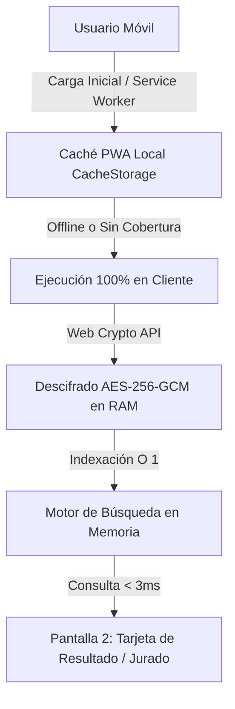

# Padrón Electoral Unidad Veterinaria 2024-2026
> **Facultad de Ciencias Veterinarias — Universidad Autónoma Gabriel René Moreno (UAGRM)**  
> Aplicación web progresiva (PWA) de consulta electoral ultra-rápida, con funcionamiento 100% Offline, verificación de Jurados Electorales, resolución de mesas paritarias y protección de datos mediante cifrado AES-256-GCM.

---

## 1. Contexto del Problema y Desafíos del Proyecto

Durante las elecciones universitarias en los predios de la Facultad de Ciencias Veterinarias, se presentan condiciones críticas para cualquier sistema de información:

1. **Colapso de Conectividad Móvil**: La concentración masiva de estudiantes suele saturar las antenas 4G/LTE locales. Si el sistema dependiera de una conexión a internet activa para cada consulta, el usuario experimentaría pantallas congeladas o errores de tiempo de espera.
2. **Inmediatez en la Experiencia (< 1 segundo)**: Los votantes y delegados de mesa necesitan saber en qué mesa votan y si fueron seleccionados como Jurados Electorales en milisegundos para agilizar las filas.
3. **Distribución Paritaria de Mesas y Casos Frontera**: Las mesas electorales no se dividen por letras arbitrarias ('A' a 'D'), sino mediante una división matemática paritaria (equitativa) entre las 9 mesas habilitadas (Mesas 183 a 191). Esto origina casos limítrofes donde personas con apellidos similares o el mismo apellido pertenecen a mesas distintas (ej. *Chávez* en Mesa 184 y *Choque* en Mesa 185; o divisiones internas dentro de apellidos comunes como *García*).
4. **Protección de Datos contra Scraping**: Evitar que terceros puedan descargar o raspar fácilmente la base de datos completa de estudiantes desde los archivos de la aplicación web.

---

## 2. Decisiones Arquitectónicas y Soluciones Técnicas



### ❌ Descarte de Server-Side Rendering (SSR)
Se evaluó inicialmente la arquitectura SSR (Next.js / Nuxt / Node.js). Se **descartó categóricamente** por los siguientes motivos:
- **Dependencia de la red en tiempo de ejecución**: En SSR, cada pulsación del botón "Buscar" envía una petición HTTP al servidor para renderizar el HTML. Con baja señal celular, la tasa de fallo de las peticiones superaría el 40%, inhabilitando el sitio para cientos de estudiantes en los pasillos de votación.
- **Costos y fragilidad**: Mantener servidores de renderizado activos añade puntos de fallo innecesarios.

### ✅ Elección: JAMstack + PWA Offline-First (Vite + Tailwind CSS)
- **Descarga única perimetral**: Los 2,484 registros del padrón se empaquetan en una estructura optimizada que comprimida pesa apenas **~45 KB** (menos que una sola imagen pequeña).
- **Service Worker (`public/sw.js`)**: Al acceder por primera vez, el navegador guarda en su caché local el shell HTML, el bundle JS/CSS, las 10 imágenes WebP y el paquete de datos cifrado. A partir de ese momento, la web funciona **incluso en Modo Avión** o sin chip SIM.
- **Respuesta instantánea en RAM**: Las búsquedas se resuelven en memoria local en **menos de 3 milisegundos**.
- **Despliegue Global en Vercel**: Configurado con `vercel.json` para distribución perimetral (Edge CDN) con compresión Brotli y cabeceras de caché inmutable para assets.

---

## 3. Capa de Seguridad y Cifrado de Fuentes (Anti-Scraping)

Para proteger los registros estudiantiles frente a descargas no autorizadas, se implementó una arquitectura de cifrado simétrico en reposo y en tránsito:

1. **Cifrado AES-256-GCM en Build (`scripts/encrypt_padron.py`)**:
   - La base de datos compacta no se expone como texto plano (`.json`).
   - Se procesa con **AES-256-GCM** (Galois/Counter Mode) usando un vector de inicialización (IV) de 96 bits aleatorio y autenticación criptográfica.
   - El resultado se compila en un módulo JavaScript `src/data/padron.enc.js` que contiene el payload cifrado en Base64.
2. **Descifrado en Memoria RAM con Web Crypto API**:
   - En el cliente (`src/searchEngine.js`), el navegador descifra el bloque en milisegundos utilizando la API criptográfica nativa de bajo nivel (`window.crypto.subtle`).
   - La firma criptográfica se construye mediante fragmentos ofuscados que son minimizados y ofuscados por Vite/esbuild en el bundle de producción.
   - La base de datos descifrada reside **únicamente en la memoria RAM volátil** durante la sesión y nunca se escribe en disco ni se expone en la pestaña Network de las DevTools como texto claro.

---

## 4. Ingeniería de Datos y Lógica Electoral

### 4.1 Extracción con Fidelidad Total de Caracteres
A partir del documento oficial de 72 páginas, el script `scripts/extract_padron.py` extrajo y estructuró:
- **2,484 estudiantes** de la Facultad de Ciencias Veterinarias (Carrera: *Medicina Veterinaria y Zootecnia*).
- Desglose algorítmico inteligente de nombres y apellidos:
  - Manejo de apellidos compuestos: `DE LAS MUÑECAS`, `DA SILVA`, `DEL GRANADO`, `DE CAMPOS`, `EL HAGE`, `LA FUENTE`, `SANTA CRUZ`, `SAN MARTINI`, `DE LA CRUZ`, `DE LA BARRA`, etc.
  - Corrección de codificación WinAnsi para preservar la letra `Ñ` y vocales con tilde (`Á`, `É`, `Í`, `Ó`, `Ú`).
- Habilitaciones individuales para: **Centro Interno**, **ICU Facultativo** y **FUL**.

### 4.2 Verificación de Jurados Electorales
Se integró la lista oficial de los **27 estudiantes designados Jurados Electorales** (3 jurados por mesa, de la Mesa 183 a la 191).
- La consulta verifica en $O(1)$ la condición de jurado.
- Si el estudiante es jurado, el sistema despliega un banner destacado en color naranja `#EC7D17` alertando su designación y especificando su mesa.

### 4.3 Mesas Paritarias Alfabéticas (Mesas 183 a 191)
Para garantizar una distribución equitativa de votantes por mesa, los límites oficiales asignados son:

| Mesa | Rango de Apellidos | Votantes | Jurados Electorales Designados |
| :---: | :--- | :---: | :--- |
| **183** | *ABAN BURLES* a *BARRIOS QUISPE* | 300 | Aguilar Paniagua M., Antelo Campos R., Balderrama Roncales N. |
| **184** | *BARRON GUTIERREZ* a *CONDE CABRERA* | 300 | Campos Ballesteros I., Cayo Escalera M., Chumacero Copa M. |
| **185** | *CONDE CUELLAR* a *GARCIA SAAVEDRA* | 300 | Cuellar Moreno R., Espinoza Padilla M., Garcia Escobar A. |
| **186** | *GARCIA SALAS* a *LOBO ROMERO* | 300 | Garcia Vedia J., Gonzales Hinojosa A., Jimenez Parraga A. |
| **187** | *LOLA MORENO* a *NUÑEZ SUAREZ* | 300 | Mansilla Nuñez Y., Mendez Garcia M., Moron Paniagua J. |
| **188** | *OCAMPO OCAMPO* a *RENDON PARAPAINO* | 300 | Ocampo Ocampo M., Pereira Rodriguez P., Ramirez Jimenez O. |
| **189** | *RENTERIA FRANCO* a *SOLAR GUTIERREZ* | 300 | Rodriguez Trujillo A., Roman Hurtado A., Sanchez Anzieta C. |
| **190** | *SOLETO MULLISACA* a *VILLALON MONTERO* | 300 | Soliz Martinez M., Suarez Zabala C., Verastegui Marañon A. |
| **191** | *VILLAMOR CALLE* a *ZURITA QUIMAYA* | 84 | Villca Almendras J., Villca Rios A., Zurita Quimaya N. |

> **Mecanismo de Desambiguación**: Cuando el usuario busca un apellido común o fronterizo (ej. `"CHAVEZ"` presente en Mesas 183 y 184), la aplicación muestra una lista de coincidencias con el nombre completo y la mesa asignada para que el usuario seleccione su registro exacto con un solo tap.

---

## 5. Diseño Mobile-First y Flujo de Pantallas

La interfaz está construida con la paleta de colores institucional:
- **Cian Primario (`#31A6CA`)**: Cabecera, acentos y bordes de tarjetas.
- **Cian Secundario (`#35A9C6`)**: Gradientes suaves en fondos y botones.
- **Naranja de Acento (`#EC7D17`)**: Botón de búsqueda, banner de Jurado Electoral y badge de Mesa.
- **Oscuro (`#040304`)**: Tipografía de alto contraste bajo el sol.
- **Blanco (`#FFFFFF`) y Fondo (`#F1F8FA`)**: Superficies limpias y tarjetas.

### Flujo de Interacción tipo App Móvil:
1. **Pantalla 1 (Inicio y Consulta)**:
   - **Cabecera oculta**: La cabecera superior permanece oculta al ingresar para maximizar el área de visualización.
   - **Diseño limpio y enfocado**: Acceso directo y prioritario al campo de consulta para máxima rapidez.
   - **Sección "¿No sabes dónde Votar?"**: Campo de entrada con autolimpieza (`✕`) y botón prominente `Buscar` en color naranja.
   - **Acordeón Informativo**: Pestaña desplegable con la tabla completa de distribución de mesas para delegados estudiantiles.
2. **Transición a Pantalla 2 (Respuesta Exclusiva)**:
   - Al pulsar `Buscar`, se oculta la pantalla 1 y se activa la **Cabecera Fija** con el botón flecha (`←`), el título oficial y el indicador offline/online.
   - Se ejecuta un micro-loader animado (~350ms) con ícono de huella veterinaria.
   - Se muestra **exclusivamente la respuesta**:
     - Badge gigante de la **Mesa de Votación**.
     - Banner de estado de **Jurado Electoral**.
     - Datos personales del estudiante.
     - Habilitaciones (Centro Interno, ICU, FUL).
     - Botón **"Nueva Consulta"** para regresar a la pantalla inicial en un tap.

---

## 6. Estructura de Archivos del Repositorio

```
tukiPadron/
├── index.html                   # Documento HTML5 con layout de pantallas móviles
├── package.json                 # Dependencias (Vite, Tailwind, PostCSS)
├── vite.config.js               # Configuración de compilación optimizada
├── vercel.json                  # Reglas de enrutamiento SPA y cabeceras de caché Vercel
├── tailwind.config.js           # Paleta oficial institucional
├── postcss.config.js            # Pipeline PostCSS
├── public/
│   ├── manifest.json            # Web App Manifest para instalación PWA en móviles
│   ├── sw.js                    # Service Worker con estrategia de caché offline
│   ├── favicon.svg              # Favicon institucional
│   ├── icons/                   # Íconos de instalación PWA (192px y 512px)
│   └── images/                  # Logotipos WebP institucionales (logo1 y logo2)
├── src/
│   ├── main.js                  # Orquestador de pantallas móviles, eventos y PWA
│   ├── style.css                # Estilos Tailwind y animaciones de transición
│   ├── searchEngine.js          # Motor de búsqueda y descifrado AES-256-GCM
│   └── data/
│       ├── padron.enc.js        # Base de datos cifrada para el cliente (273 KB)
│       ├── padron_compacto.json # Estructura compacta pre-cifrado (205 KB)
│       ├── padron_habilitados.json # Padrón completo en JSON legible
│       ├── mesas_info.json      # Información de rangos oficiales por mesa
│       ├── registros.txt        # Lista plana de los 2,484 registros
│       └── registros.json       # Array JSON de números de registro
└── scripts/
    ├── extract_padron.py        # Extractor desde el PDF oficial
    ├── prepare_images.py        # Generador de logotipos WebP e íconos PWA
    ├── encrypt_padron.py        # Cifrador de la base de datos a AES-256-GCM
    └── test_search.js           # Pruebas automatizadas del motor de búsqueda
```

---

## 7. Guía de Ejecución y Despliegue

### Requisitos Previos:
- Node.js v18+ y npm
- Python 3.10+ (solo necesario si se desea re-extraer o recifrar los datos)

### Instalación y Desarrollo Local:
```powershell
# 1. Instalar dependencias
npm install

# 2. Iniciar servidor de desarrollo
npm run dev
# Abrir la URL local (ej. http://localhost:5173) en el navegador
```

### Compilación para Producción:
```powershell
npm run build
# Genera el directorio optimizado 'dist/' en ~1.5 segundos
```

### Despliegue en Vercel:
1. Sube los cambios a tu repositorio de GitHub:
   ```powershell
   git add .
   git commit -m "feat: consultor padron unidad veterinaria pwa offline"
   git push origin main
   ```
2. En [vercel.com](https://vercel.com), selecciona **Add New Project** e importa el repositorio `tukiPadron`.
3. Vercel detectará automáticamente la configuración de Vite y `vercel.json`.
4. Haz clic en **Deploy**. La aplicación quedará disponible en su CDN global con soporte HTTPS y compresión Brotli automática.
